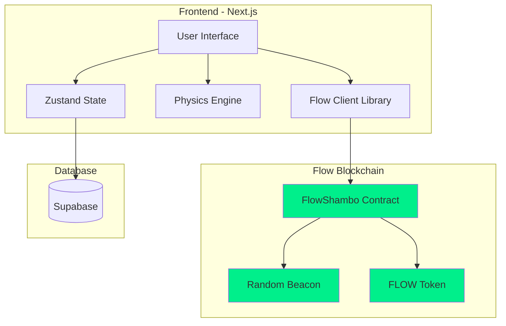
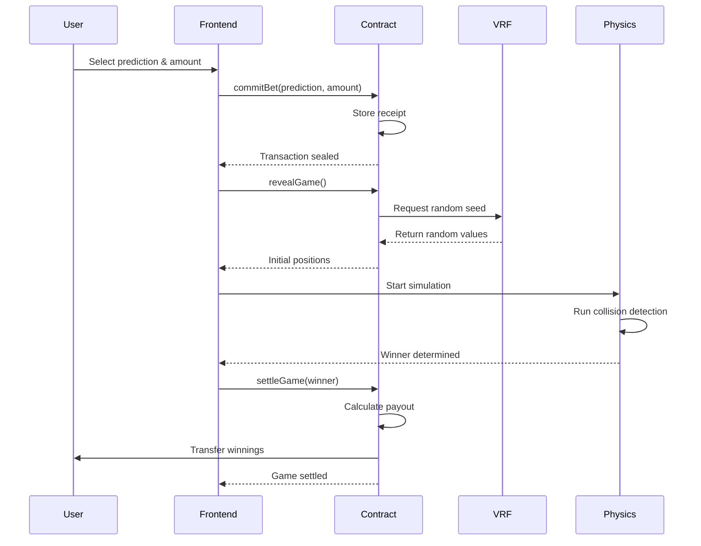
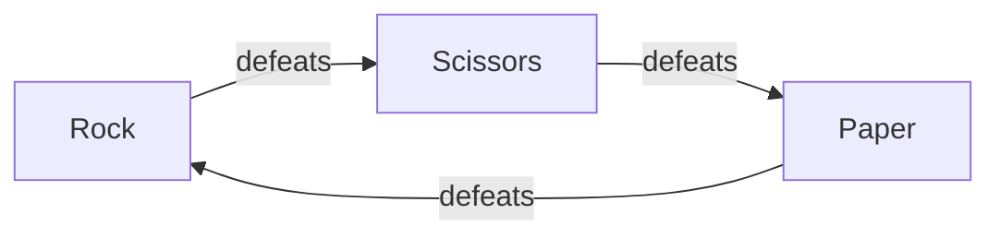

# FlowShambo

A physics-based rock-paper-scissors betting game built on Flow blockchain. Players place bets on their prediction, and the outcome is determined through a real-time physics simulation using Flow's native VRF for randomness.

## Architecture



## Game Flow



## Tech Stack

### Frontend
- **Framework**: Next.js 16 (App Router)
- **Language**: TypeScript
- **Styling**: Tailwind CSS 4
- **State Management**: Zustand
- **Testing**: Vitest + React Testing Library

### Blockchain
- **Network**: Flow Testnet
- **Smart Contract**: Cadence
- **Wallet Integration**: FCL (Flow Client Library)
- **Randomness**: Flow Native VRF (RandomBeaconHistory)

### Backend
- **Database**: Supabase (PostgreSQL)
- **Real-time**: Supabase Realtime subscriptions

## Project Structure

```
flow-shambo/
├── cadence/
│   ├── contracts/
│   │   └── FlowShambo.cdc          # Main game contract
│   ├── scripts/                     # Read-only queries
│   └── transactions/                # State-changing operations
├── src/
│   ├── app/                         # Next.js app router
│   ├── components/                  # React components
│   ├── hooks/                       # Custom React hooks
│   ├── lib/
│   │   ├── betting/                 # Bet validation & settlement
│   │   ├── game/                    # Game logic
│   │   ├── physics/                 # Physics engine
│   │   └── errors/                  # Error handling
│   ├── stores/                      # Zustand stores
│   └── types/                       # TypeScript definitions
└── public/                          # Static assets
```

## Smart Contract

### Core Functions

```cadence
// Phase 1: Commit bet
commitBet(prediction: UInt8, betAmount: UFix64)

// Phase 2: Reveal game with VRF
revealGame() -> InitialGameData

// Phase 3: Settle and payout
settleGame(receipt: Receipt, winningType: UInt8) -> Vault
```

### Game Parameters

| Parameter | Value | Description |
|-----------|-------|-------------|
| MIN_BET | 0.1 FLOW | Minimum bet amount |
| MAX_BET | 100.0 FLOW | Maximum bet amount |
| PAYOUT_MULTIPLIER | 2.5x | Winning payout multiplier |
| OBJECT_COUNT | 30 | Total objects in simulation |

## Physics Engine

The game uses a custom 2D physics engine with:

- Elastic collision detection
- Rock-paper-scissors transformation rules
- Boundary collision handling
- Real-time rendering on HTML5 Canvas

### Transformation Rules



## Installation

### Prerequisites

- Node.js 18+
- Flow CLI
- Supabase account

### Setup

1. Clone the repository
```bash
git clone <repository-url>
cd flow-shambo
```

2. Install dependencies
```bash
npm install
```

3. Configure environment variables
```bash
cp .env.example .env.local
```

Edit `.env.local`:
```env
NEXT_PUBLIC_FLOW_ACCESS_NODE=https://rest-testnet.onflow.org
NEXT_PUBLIC_WALLET_DISCOVERY=https://fcl-discovery.onflow.org/testnet/authn
NEXT_PUBLIC_FLOWSHAMBO_ADDRESS=<your-contract-address>
NEXT_PUBLIC_SUPABASE_URL=<your-supabase-url>
NEXT_PUBLIC_SUPABASE_ANON_KEY=<your-supabase-key>
```

4. Deploy contract (optional)
```bash
flow project deploy --network=testnet
```

5. Run development server
```bash
npm run dev
```

## Database Schema

```sql
CREATE TABLE games (
    id UUID PRIMARY KEY DEFAULT gen_random_uuid(),
    created_at TIMESTAMP WITH TIME ZONE DEFAULT NOW(),
    player_address TEXT NOT NULL,
    bet_amount NUMERIC NOT NULL,
    prediction TEXT NOT NULL CHECK (prediction IN ('rock', 'paper', 'scissors')),
    winner TEXT NOT NULL CHECK (winner IN ('rock', 'paper', 'scissors')),
    payout NUMERIC NOT NULL DEFAULT 0,
    transaction_id TEXT NOT NULL,
    status TEXT DEFAULT 'completed'
);

CREATE INDEX idx_games_created_at ON games(created_at DESC);
CREATE INDEX idx_games_player ON games(player_address);
```

## Testing

Run all tests:
```bash
npm test
```

Run tests with coverage:
```bash
npm run test:coverage
```

Run tests in watch mode:
```bash
npm run test:ui
```

### Test Coverage

- Unit tests for all game logic
- Integration tests for blockchain interactions
- Component tests for UI elements
- Property-based tests for physics engine

## Deployment

### Vercel

1. Push to GitHub
2. Import project in Vercel
3. Configure environment variables
4. Deploy

### Environment Variables (Production)

Set these in Vercel dashboard:
- `NEXT_PUBLIC_FLOW_ACCESS_NODE`
- `NEXT_PUBLIC_WALLET_DISCOVERY`
- `NEXT_PUBLIC_FUNGIBLE_TOKEN_ADDRESS`
- `NEXT_PUBLIC_FLOW_TOKEN_ADDRESS`
- `NEXT_PUBLIC_FLOWSHAMBO_ADDRESS`
- `NEXT_PUBLIC_SUPABASE_URL`
- `NEXT_PUBLIC_SUPABASE_ANON_KEY`

## Contract Addresses

### Testnet

| Contract | Address |
|----------|---------|
| FlowShambo | `0x9d8d1e6cee0341ec` |
| FungibleToken | `0x9a0766d93b6608b7` |
| FlowToken | `0x7e60df042a9c0868` |
| RandomBeaconHistory | `0xe467b9dd11fa00df` |

## API Reference

### Hooks

#### `usePlaceBet()`
Places a bet on the blockchain.

```typescript
const { placeBet, isPlacing, error } = usePlaceBet();
await placeBet('rock', 1.0);
```

#### `useRevealGame()`
Reveals game with VRF randomness.

```typescript
const { revealGame, isRevealing } = useRevealGame();
const initData = await revealGame();
```

#### `useSimulation()`
Runs physics simulation.

```typescript
const { start, objects, status, winner } = useSimulation();
start(initialData);
```

#### `useSettleGame()`
Settles game and processes payout.

```typescript
const { settleGame, isSettling } = useSettleGame();
await settleGame(winner);
```

## Performance

- Initial load: < 2s
- Time to interactive: < 3s
- Simulation FPS: 60
- Transaction confirmation: ~2-3s (Flow testnet)

## Security

- All bets are committed on-chain before reveal
- VRF ensures unpredictable randomness
- Client-side simulation is deterministic
- No server-side game logic (trustless)

## License

MIT

## Links

- Live Demo: https://flow-shambo.vercel.app
- Flow Blockchain: https://flow.com
- Documentation: https://developers.flow.com
